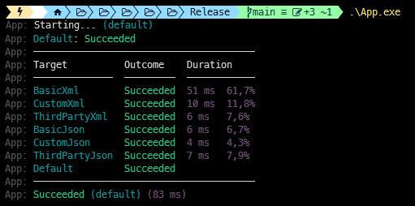

[](https://github.com/aimenux/DataContractSerializerDemo/actions/workflows/ci.yml)

# DataContractSerializerDemo
```
Implementing serialization/deserialization with data contract serializer
```

> In this repo, i m implementing xml/json serialization/deserialization with [data contract xml serializer](https://docs.microsoft.com/en-us/dotnet/api/system.runtime.serialization.json.datacontractjsonserializer) and [data contract json serializer](https://docs.microsoft.com/en-us/dotnet/api/system.runtime.serialization.json.datacontractjsonserializer) :
>
> :one: **BasicSerialization** 
>> Models are only decorated with [Serializable attribute](https://docs.microsoft.com/en-us/dotnet/api/system.serializableattribute)
>
> :two: **CustomSerialization**
>> Models are decorated with [Serializable attribute](https://docs.microsoft.com/en-us/dotnet/api/system.serializableattribute)
>>
>> Models are implementing [ISerializable interface](https://docs.microsoft.com/en-us/dotnet/api/system.runtime.serialization.iserializable)
>
> :three: **ThirdPartySerialization**
>> Models are considered as third party classes (can't be modified)
>>
>> Models are serialized using [IDataContractSurrogate interface](https://docs.microsoft.com/en-us/dotnet/api/system.runtime.serialization.idatacontractsurrogate)
>
> To run code in debug or release mode, type the following commands in your favorite terminal : 
> - `.\App.exe`
> - `.\App.exe Default`
> - `.\App.exe BasicXml`
> - `.\App.exe CustomXml`
> - `.\App.exe ThirdPartyXml`
> - `.\App.exe BasicJson`
> - `.\App.exe CustomJson`
> - `.\App.exe ThirdPartyJson`
>
>
> 
>

**`Tools`** : vs19, net 4.8, data contract xml serializer, data contract json serializer, bullseye
